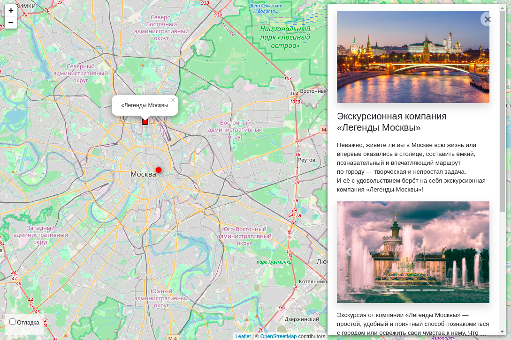

### Интерактивная карта Москвы.
На карте отображены виды активного отдыха с подробными описаниями и комментариями.

Карта доступна по ссылке: [интерактивная карта](http://gosha1.pythonanywhere.com/).
### Как установить

Для запуска на своем компьютере вам потребуется:

1. Свежая версия [Python](https://www.python.org).
2. Сохранить библиотеку на свой компьютер:
```
https://github.com/inkvizitor1991/yandex-afisha.git
``` 
3. Установить зависимости:
```
pip install -r requirements.txt
``` 
4. Создайте базу данных SQLite:

```sh
python3 manage.py migrate
```
5. Запустить скрипт:
```
python manage.py runserver
``` 
6. Перейти по ссылке:
`http://127.0.0.1:5500`

### Загрузить больше данных

Вы можете загрузить на сайт больше данных, перейдите по ссылке и следуйте инструкции: [данные для проекта](https://github.com/devmanorg/where-to-go-places). \
Укажите путь до JSON.
```
python manage.py load_place http://адрес/файла.json
```

### Переменные окружения

Часть настроек проекта берётся из переменных окружения. Чтобы их определить, создайте файл `.env` рядом с `manage.py` и запишите туда данные в таком формате: `ПЕРЕМЕННАЯ=значение`.

Доступны 3 переменные:
- `DEBUG` — дебаг-режим. Поставьте `True`, чтобы увидеть отладочную информацию в случае ошибки.
- `SECRET_KEY` — секретный ключ проекта
- `ALLOWED_HOSTS` — см [документацию Django](https://docs.djangoproject.com/en/3.1/ref/settings/#allowed-hosts)  

## Цели проекта
Все книги были взяты с сайта [tululu.org](https://tululu.org).\
Код написан в учебных целях — это урок в курсе по Python и веб-разработке на сайте [Devman](https://dvmn.org).


